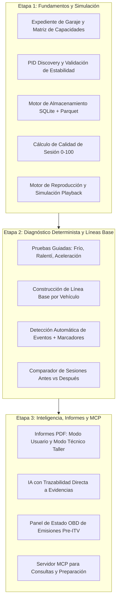

# Arquitectura y Reglas de Diagnóstico — Mi Coche por Dentro

## 1. Principios de Ingeniería y Rigor Técnico

Para garantizar que el software sea honesto, verificado y científicamente riguroso, se establecen las siguientes reglas obligatorias de diseño:

### 1.1. No Inventar Porcentajes ni Promesas Comercializadas
* **Clasificación de compatibilidad obligatoria:** Ninguna función se etiquetará como "100% compatible" o "diagnóstico exacto". Se utilizará la matriz de estado:
  * `Confirmado mediante prueba real`
  * `Probable (OBD-II genérico)`
  * `Propietario (Requiere plugin específico)`
  * `No disponible / Desconocido`
* **Matriz de Capacidades Dinámica:** Al conectar un vehículo por primera vez, el módulo `pid_discovery.py` escanea los PIDs J1979 expuestos, verifica su estabilidad real y genera la tabla de capacidades del vehículo en su expediente.

### 1.2. Separación Estricta de Capas de Información
Toda respuesta, reporte e informe debe desglosar la información en 7 categorías claras:
1. **Datos Observados:** Valores numéricos y hechos leídos directamente del bus.
2. **Anomalías Detectadas:** Variaciones calculadas matemáticamente por el motor de reglas.
3. **Interpretación:** Explicación técnica de la relación entre datos.
4. **Hipótesis:** Causas probables sin darlas por confirmadas.
5. **Datos Ausentes / Faltantes:** Información necesaria para distinguir entre hipótesis.
6. **Siguiente Prueba Recomendada:** Pasos de comprobación física o capturas adicionales.
7. **Nivel de Confianza:** Clasificado como `Bajo`, `Medio` o `Alto` (justificado por calidad de captura y repetición).

### 1.3. Diferencia entre Datos Medidos y Solicitados
* No confundir MAP (presión absoluta de colector medida) con presión de turbo solicitada por la ECU (que es un parámetro UDS propietario).
* No confundir MAF medido con caudal de aire objetivo.
* Indicar expresamente cuando únicamente se disponga del valor medido.

### 1.4. Puntuación de Calidad de Sesión (Session Quality Score: 0–100)
Cada sesión registrada recibe un índice de calidad previo al análisis de la IA:
* `% de muestras válidas y respuestas sin timeout.`
* `Latencia media del bus (ms).`
* `Frecuencia efectiva de refresco (Hz).`
* `Número de reconexiones o vacíos de datos.`
* La IA recibe la puntuación de calidad como restricción: si la calidad es baja (<70/100), la IA limitará el alcance de sus hipótesis.

### 1.5. Líneas Base Propias por Vehículo (Vehicle Baselines)
En lugar de comparar contra rangos universales teóricos:
* El sistema construye una línea base del vehículo tras 3-5 sesiones normales (tiempo de calentamiento habitual, ralentí normal, MAF habitual a ciertas RPM).
* Las anomalías se evalúan como desviaciones respecto a la mediana del propio coche (*"El calentamiento ha tardado un 35% más que la media habitual de este vehículo"*).

### 1.6. Trazabilidad de Conclusiones de IA
* Cada frase diagnóstica emitida por la IA en un informe (ej: *"Se detectó una caída de MAP del 18%"*) debe estar vinculada a un identificador de evidencia (ID de sesión + timestamp exacto + señal).
* El usuario puede hacer clic en la afirmación del informe y el Dashboard saltará al intervalo exacto de la gráfica que sostiene la afirmación.

---

## 2. Seguridad y Modelo MCP (Human-in-the-Loop)

### 2.1. Regla de Solo Lectura en Fase Inicial (v1)
* La versión inicial del sistema es estrictamente de **Solo Lectura** (adquisición de telemetría, lectura de DTC, lectura de Freeze Frames y monitores `I/M Readiness`).
* Se prohíbe el borrado de DTCs, comandos de escritura CAN, pruebas de actuadores o alteraciones de estado en el bucle principal.

### 2.2. Arquitectura de Seguridad para Acciones de Servicio Futuras (v2)
Si en el futuro se habilitan funciones de servicio (ej: reset de mantenimiento o modo servicio EPB):
1. **El MCP NUNCA tendrá acceso a comandos de escritura arbitrarios** (`send_raw_can`, `write_uds`).
2. El MCP únicamente puede invocar herramientas de consulta y preparación (`prepare_service_action`).
3. **Token de Autorización Única:** La ejecución física requiere que el usuario confirme manualmente en el Dashboard local, generando un token temporal de un solo uso (caducidad 30s) ligado al VIN y a la acción.
4. **Precondiciones Específicas por Rutina:** Cada rutina evalúa sus precondiciones exclusivas (ej. EPB exige motor apagado + contacto ON; DPF exige motor encendido + coolant > 70°C).

---

## 3. Hoja de Ruta en 3 Etapas

